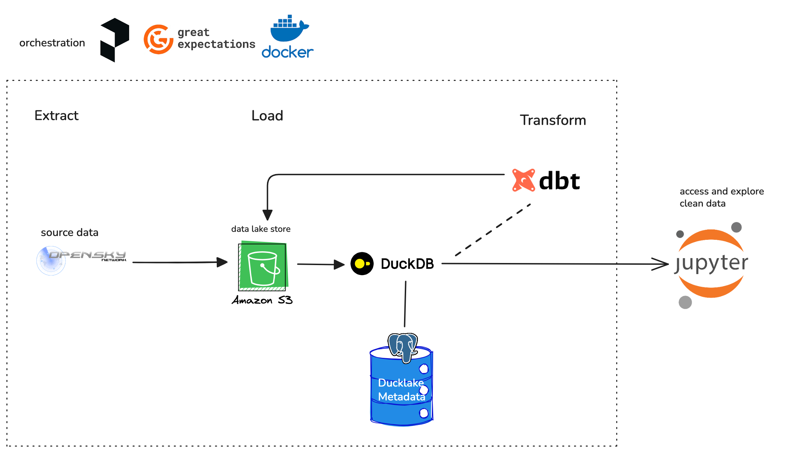

# Skylake
  
## Scoping:
### MVP:
_An AWS- and codebase-focused pipeline with batch processing of OpenSky API data into a data lakehouse with simple transformed tables. Focus on AWS and open source software tools. Plus an example notebook to query transformed tables and draw basic insights._

### Q3 2025 Project Goals
1. Determine MVP requirements of project ✅
2. Make visualization of data processing flow on excalidraw
3. Explore OpenSky API in a notebook (using `requests` for practice)

### Q4 2025: early Q1 2026 Project Goals
1. Well-documented, clean MVP code
   1. duckdb lake setup on aws
   2. data quality monitoring and testing throughout pipeline
      1. local and automatic Github testing
   3. transformations with dbt
   4. example usage of datalake in a jupyter notebook
2. Documentation of the process
3. Make Github repo public

#### MVP Project Diagram

### late Q1 2026 Project Goals
#### Post-MVP feature ideas (in order of desired implementation):
- streaming-ingest
- dashboard with basic visualizations (grafana)
- webapp with near-real-time visualizations
- create business logic metrics and corresponding transformations
- incorporate geospatial data processing (overlap of opensky and weather data)
- data science analytics exercises on the gold data
    - A/B tests